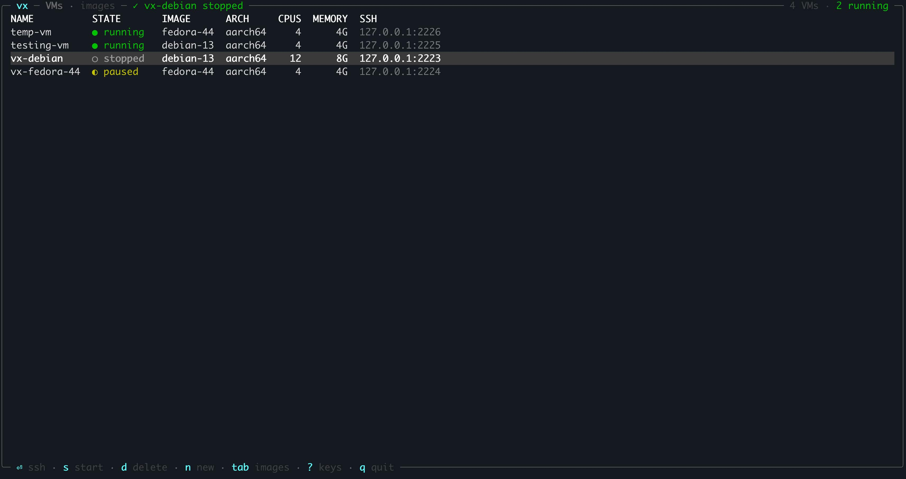
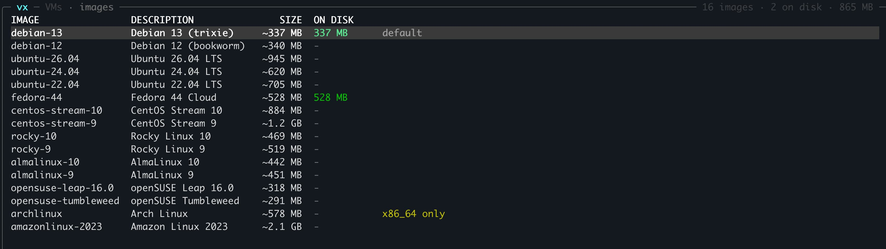

<p align="center">
  
</p>

# vx

After writing one too many bash scripts to manage my QEMU VMs, I vibecoded `vx` to be the zero-config VM management CLI and TUI of your dreams! It has *never* been easier to provision, manage, and ssh into Linux VMs from the terminal.

```
vx new dev    # create and boot a VM
vx ssh dev    # connect to it
vx            # open the dashboard
```

vx uses QEMU under the hood, needs no sudo or config file, and keeps each VM in its own directory under `~/.vx`.

Works on macOS and Linux.

## Install

Needs QEMU (`brew install qemu`, or your package manager) and Rust.

```
cargo install --git https://github.com/AlexanderWangY/vx
```

## Dashboard

Run `vx` with no arguments.



`⏎` ssh · `s` start · `x` stop · `p` pause · `n` new · `d` delete · `tab` images · `?` all keys



## Commands

```
vx new web --image fedora-44 --cpus 2 --mem 8G --disk 40G
vx new                          # no name: fill in a form
vx ls
vx start | stop | pause | resume <vm>
vx ssh <vm> [-- cmd]            # starts it first if needed
vx console <vm>                 # serial console, Ctrl-] to detach
vx logs -f <vm>
vx rm <vm>
```

Leave out the VM name and you get a picker.

## Images

16 popular distros are built in. `vx images` lists them. Each is downloaded once, checked against its published checksum, and cached.

Bring your own qcow2 or raw image:

```
vx images add mybox ~/Downloads/mybox.qcow2
vx new dev --image mybox
```

## Tricks

- `vx ssh dev -- uname -a` runs one command.
- Put `Include ~/.vx/vms/*/ssh_config` at the top of `~/.ssh/config`, then `ssh dev.vx`, `scp` and `rsync` just work.
- Forward ports: add `forward = ["8080:80"]` above `[ssh]` in `~/.vx/vms/dev/vx.toml`. Applies on next start.
- `vx images pull ubuntu-24.04` downloads ahead of time.
- `VX_HOME=/somewhere/else` keeps everything somewhere else.
